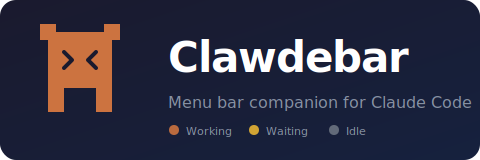

<p align="center">
  
</p>

A lightweight macOS menu bar app that keeps you in the loop while Claude Code works.

Stop watching your terminal. Glance at the menu bar to see what Claude is doing across all sessions.

## Features

- **Clawde in your menu bar** — the Claude Code mascot changes color based on status
- **Multi-session support** — tracks all running Claude Code sessions, shows count badge
- **Click to see all sessions** — popover lists every session with status, directory, and terminal app
- **One-click focus** — click a session to jump to its terminal (VSCode, iTerm, Warp, Terminal, etc.)
- **Sleep prevention** — your MacBook stays awake while any session is working
- **Auto-start on login** — registers itself as a Login Item, survives reboots
- **Auto-cleanup** — stale sessions are removed automatically
- **Session statistics** — tracks working time, tool usage, and session history
- **Per-session timer** — see how long each session has been running
- **7-day history** — daily breakdown with working time bars
- **Tool usage chart** — see which tools Claude uses most (Write, Bash, Read, etc.)

## How it works

```
Claude Code hooks → writes JSON to /tmp/claude-status-{session}.json → Swift app watches files
```

Each Claude Code session writes its own status file via [hooks](https://docs.anthropic.com/en/docs/claude-code/hooks). The app watches `/tmp` for changes, aggregates state across all sessions, and shows the highest-priority status:

| Priority | Hook Events | Icon |
|---|---|---|
| Waiting (highest) | `PermissionRequest` | Clawde yellow, blinking |
| Working | `PreToolUse`, `PostToolUse` | Clawde orange, pulsing |
| Idle | `SessionStart`, `Stop` | Clawde gray (template) |

When multiple sessions are active, a badge shows the count (e.g. "3").

## Requirements

- macOS 13.0+ (Ventura or later)
- Python 3 (pre-installed on macOS)
- [Claude Code](https://docs.anthropic.com/en/docs/claude-code)

## Install

### Download (recommended)

1. Download `Clawdebar.zip` from [Releases](../../releases/latest)
2. Unzip and move `Clawdebar.app` to `~/Applications/` (or `/Applications/`)
3. Open the app

> **Note:** The app is not code-signed, so macOS Gatekeeper will block the first launch. To allow it, right-click the app → **Open**, or run:
> ```bash
> xattr -cr ~/Applications/Clawdebar.app
> ```

On first launch, Clawdebar automatically:
- Installs the hook script to `~/.claude/hooks/statusbar/`
- Registers hooks in `~/.claude/settings.json`
- Registers as a Login Item (auto-start on boot)

### Build from source

```bash
git clone <repo-url>
cd clawdebar
./install.sh
open ~/Applications/Clawdebar.app
```

## Supported terminals

The hook script auto-detects which app Claude Code is running in:

| Terminal | Detection | Focus action |
|---|---|---|
| VSCode | Process tree + `TERM_PROGRAM` | `code --goto` + activate |
| Terminal.app | Process tree | AppleScript: finds exact tab by TTY, unminimizes window |
| iTerm2 | Process tree | Activate by bundle ID |
| Warp | Process tree | Activate by bundle ID |
| kitty | Process tree | Activate by name |
| Alacritty | Process tree | Activate by name |
| WezTerm | Process tree | Activate by name |

> **Note:** For Terminal.app, the first time you click a session, macOS will ask for Automation permission. This is a one-time prompt — after granting it, Clawdebar can find and unminimize the exact Terminal tab. If denied, it still brings Terminal to front but won't select the specific tab.

## Uninstall

```bash
./uninstall.sh
```

This removes everything:
1. Kills the running app
2. Deletes `~/Applications/Clawdebar.app` (and its Login Item registration)
3. Removes the hook script from `~/.claude/hooks/statusbar/`
4. Cleans up `~/.claude/settings.json` (removes only statusbar hooks, preserves the rest)
5. Deletes all `/tmp/claude-status-*.json` session files
6. Removes `~/.clawdebar/` stats directory

## Project structure

```
├── Package.swift              # Swift package manifest
├── install.sh                 # One-command installer
├── uninstall.sh               # Clean removal
├── hooks/
│   └── statusbar.sh           # Claude Code hook script
└── StatusBar/
    ├── StatusBarApp.swift      # Menu bar app, popover UI, Clawde icon, stats view
    ├── StatusWatcher.swift     # Multi-session file watcher
    ├── StatsStore.swift        # Session statistics tracking and persistence
    ├── HookInstaller.swift     # Auto-installs hooks on first launch
    ├── SleepManager.swift      # IOKit sleep prevention
    └── Info.plist              # App config (LSUIElement)
```

## License

MIT
